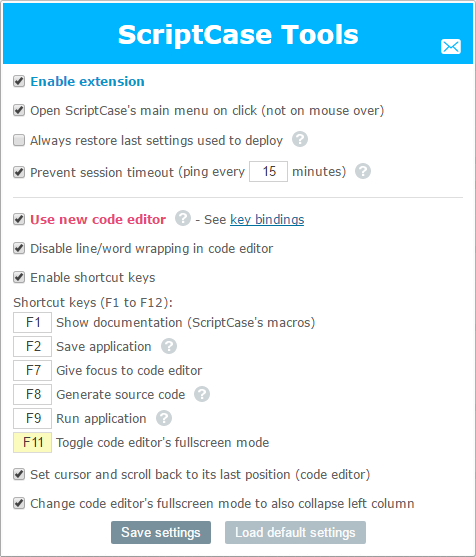

# ScriptCase Tools
A browser extension to make working with ScriptCase simpler and more productive.

## Installation

### Google Chrome

#### Quick Installation
Go to [Chrome Web Store](https://chrome.google.com/webstore/detail/scriptcase-tools/mfokofbgiajojbgginjeglebmpejnpdm) to install the release version.

#### Manual Installation (latest/development version)
1. Download the source code at https://github.com/AndersonMamede/scriptcase-tools
2. Unzip the file
3. Navigate to **chrome://extensions**
4. Ensure the checkbox labeled **Developer mode** is enabled
5. Click "**Load unpacked extension...**" and select the "**source**" folder inside the (unzipped) folder

### Firefox
[Review, signing, and distributing policies](https://developer.mozilla.org/en-US/Add-ons/Distribution) are different at [Firefox's "webstore" (AMO)](https://addons.mozilla.org). All extensions are manually reviewed by employers (or some volunteers), thus making the publishing process extremely slow: everytime an extension is submitted, whether the very first or a new version, it goes to the end of the reviewing queue.

It took **19 days** to receive a response for the first publishing attempt:
 
<i>Does this add-on only work with paid software? 
In this case, we need to ask you to switch your add-on to 'unlisted' (=selfhosted) as the add-on requires a payment for it to be useful. 
For more information, see: 
https://developer.mozilla.org/en-US/Add-ons/AMO/Policy/Reviews - Require payment to use core add-on features (upfront or after trial)</i>

That means **an extension can't be published (listed) in Firefox's "webstore" if it works together with a paid software, and although the add-on is digitally signed by Firefox's webstore, the file must be hosted by the owner/author**. And because ScriptCase Tools is an extension intented to be used with ScriptCase, which is a paid software, it was not accepted as a listed add-on.

That is why there's not an official link in Firefox's webstore for ScriptCase Tools and it must be **manually downloaded, which is very simple**:

1. Download the compiled and signed file at https://github.com/AndersonMamede/scriptcase-tools/raw/master/firefox-release/scriptcase_tools-latest.xpi
2. Drag it into Firefox window
3. Wait for the confirmation popup and then click on the "Install" button

## ScriptCase Support
* ScriptCase v7
* ScriptCase v8

Other ScriptCase versions might work correctly, but were not tested.

Any problem with ScriptCase Tools in the above Scriptcases environment should be reported as a bug in our [issue tracker](https://github.com/AndersonMamede/scriptcase-tools/issues) or as a message to [mamede.anderson@gmail.com](mailto:mamede.anderson@gmail.com).

## Why was ScriptCase Tools built?
If you often use ScriptCase to develop your applications, you've probably noticed that its development environment lacks some basic functionalities (e.g., no shortcut keys, not restoring last cursor position), while others could be improved (e.g., code editor, main menu sensitivity).

Even though some users have pointed out some of the problems on ScriptCase official forum, those improvements haven't been made yet.

This browser extension was created to fulfill these gaps.

### How does it work?
Because ScriptCase doesn't provide a public API, hacking into its JavaScript/HTML/CSS code was the (only) way to go. And because of that, this extension heavily depends on ScriptCase's code and structure (e.g., specifics JavaScript functions, the DOM structure, some elements with specific ID/class name).

## Authors
* [Anderson Mamede](https://github.com/AndersonMamede)

## Contributing
* Fork this repository
* Submit [bug reports, ideas or new features](https://github.com/AndersonMamede/scriptcase-tools/issues)  

If you are working on a new feature, please [create an issue](https://github.com/AndersonMamede/scriptcase-tools/issues) for the feature you’re working on so that we can all avoid duplicating effort. When your new feature (or fix) is ready, submit a pull request and/or attach a patch to your issue.

## Legal and License
This project is not affiliated with, sponsored by, or endorsed by Netmake Soluções em Informática.

Licensed under the MIT License. Please see [LICENSE](LICENSE) for more information.

## Features

### v1.3.2
* Fix a problem that caused the field to select the event 'OnRecord/OnFinish' to be hidden when editing a 'Run' button

### v1.3.1
* Fix: users reported that the editor was not visible in some versions of Firefox. The error was caused by the code NodeList.forEach because this function doesn't exist in some releases of Firefox

### v1.3.0
* Install Id and Uninstall survey

### v1.2.1
* Add email field in feedback form

### v1.2.0
* Release for Firefox

### v1.1.1
* Fix a problem that caused the new editor in "Templates HTML" page (app_template.php) not restore sublime marks/fold/cursor when navigating through the left menu (templates)

### v1.1.0
* New option to prevent ScriptCase session from timing out
* Now you can select a text (macro) on editor and press the shortcut key to open its documentation (default shortcut key is F1);
* New feedback form in the popup/settings box

### v1.0.0
* 'Internal libraries' and 'Templates HTML' also restore last cursor and scroll position
* New option to always restore last settings used to deploy
* New option to switch ScriptCase's default code editor to a newer and more complete version of CodeMirror:
	* Sublime Text-based shortcut keys (e.g., jump to line, selext next/all occurrences, duplicate line, etc)
	* New special theme 'Sublime Text (Detailed)', which shows invisible characters (tab and white spaces);
	* Highlight on editor and scrollbar all occurrences of the selected word/text
	* Possibility to add bookmarks/breakpoints in your code (Ctrl+F1/Alt+F1)
	* Possibility to fold/unfold code blocks (Ctrl+Q)
	* Autocomplete for PHP functions
	* Autocomplete for any word found within the editor
	* Highlight the starting and ending brackets (), {} and [] when cursor touches it

### v0.2.1
* Fix: When code editor was not found within a page, a JS exception was thrown, caused by how the verification was made

### v0.2.0
* New option to disable word/line wrapping in code editor (in SC v8, line wrapping was always on)

### v0.1.0
* Option to change ScriptCase's main menu default behavior from "open when hover" to "open when click"
* Option to make code editor's fullscreen mode collapse both left and right columns (not possible before SC v8)
* Option to set cursor and scroll back to its last known position on code editor after saving/generating/running an application and when navigating through ScriptCase's pages (e.g., events, applications settings)
* Option so set cursor and scroll back to its last known position on code editor when an application tab is clicked (application tab = 'Home' or your application)
* New shortcuts keys:
	* F1 => Show documentation (macros)
	* F2 => Save current application (same as the save button in the toolbar)
	* F7 => Give focus to code editor
	* F8 => Generate source code for current application (same as the generate source code button in the toolbar)
	* F9 => Run current application (same as the run button in the toolbar= save, generate and run)
	* F11 => Toggle code editor's fullscreen mode
